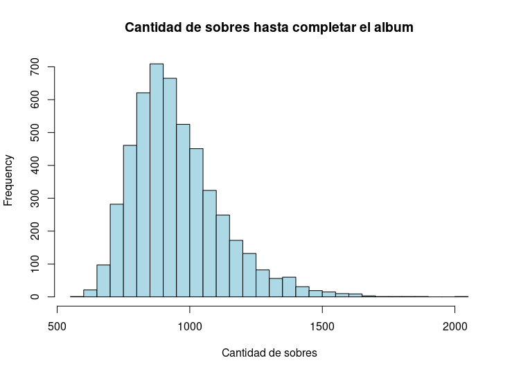

# Simulación en R del llenado del álbum de figuritas del mundial Qatar 2022 de Panini.

El álbum de figuritas del mundial tiene 670 figuritas distintas. La venta de estas se hace mediante sobres donde vienen 5. 

Este programa imita la situación de una persona comprando sobres y pegando las figuritas del sobre en el album. Este programa mediante una cantidad predefinida de simulaciones permite estimas las respuestas de las siguientes preguntas:

- Adquiridos una cantidad prefijada de sobres (por defecto 800), ¿qué probabilidad hay que se complete el album con las figuritas de esos sobres?

- ¿Cuál es el valor esperado y desviación estándar del número de sobres necesarios para completar el album? 

Además, con las simulaciones hechas graficamos el histograma de la cantidad de sobres necesarios para completar el álbum.

## Se hacen algunas suposiciones: 

- Todas las figuritas son equiprobables. 

- La elección de las 5 figuritas que vienen en cada sobre es con reposición (por lo tanto, en un sobre puede haber figuritas repetidas).

- Para completar el album siempre suponemos que no hay intercambios con otros coleccionistas de figuritas.

## Resultados hallados en una corrida del programa:

 La probabilidad estimada de llenar el album con 800 sobres es de 15.2  %. (1000 simulaciones).
 
 Por otro lado, si la cantidad de sobres es ilimitada, el histograma para la cantidad de sobres para llenar el album es:
  

  

(Obtenido mediante 5000 simulaciones).

 La cantidad de sobres esperados para completar el album es  951.7066 con una desviación estándar de 169.0872

Los cuartiles para la cantidad de sobres necesarios son los siguientes:

 | 0% | 25% | 50% | 75% | 100% |
 | --- | --- | --- | --- | --- |
 | 595 | 834 | 922 | 1038 | 2014 | 
 
